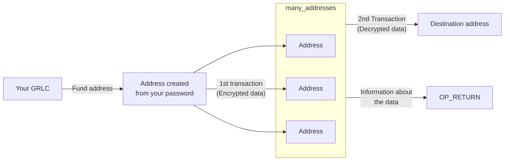

<p align="center">
  
</p>

<h1 align="center">P2SHDATA-GUI</h1>

A GUI for the [p2shdata](https://github.com/MaxPuig/p2shdata) protocol to extract/publish data from/to the blockchain.

<table>
  <tr>
    <td></td>
    <td></td>
    <td></td>
  </tr>
</table>

## HOW TO DOWNLOAD/BUILD
> You should keep the .exe (Windows) and .AppImage (Linux) files in the folder. That folder you CAN move anywhere. You could also create a shortcut to the executable and move it wherever you want.

> On macOS, open the .dmg and drag the app to wherever you want.

> To create an .AppImage on Linux, see Option 2 below.

> The app icon has the default logo. You can manually change it if you want. Look it up on the internet, or ask chatGPT :P


### Option 1
You can download the app from the [releases page](https://github.com/MaxPuig/p2shdata-gui/releases).

### Option 2
Build the app yourself.

- Have Node.js installed
- If using linux, install fuse and libfuse2
  - `sudo apt-get install fuse libfuse2 `
- Make sure to have [cmake](https://cmake.org/download/) installed (Needed when installing dependencies)

From your command line:

```bash
# Clone this repository
git clone https://github.com/MaxPuig/p2shdata-gui.git

# Go into the repository
cd p2shdata-gui

# Install dependencies
npm install

# If you just want to run the app
npm start

# If you want to build the app
npm run build
# You will find the executable in the ./deploy/{platform}/build folder.
# Windows: .exe, Linux: .AppImage, Mac: .dmg
```

## HOW IT WORKS
Here's a diagram of how the protocol works:

- You will first have to fund the address that is created from your password.
- That newly funded address will then send the data to many addresses. Your data will be split into different chunks, each containing 500 Bytes of data. Each address will be derived (created) from each chunk. At this point, the only known information stored on the blockchain is the address, no other useful data can be extracted.
- A second transaction will be created. Remember all the addresses that were created and funded in the previous step? Well, their RedeemScript is its chunk of data. Think of it as the password to be able to move the coins. This password can be seen by anyone on the blockchain. And guess what? It's the data you want to store on the blockchain! This second transaction will contain all the funds from all the addresses. They will be sent to the destination address, and your destination address will only receive 1 transaction.
- That's it! Your data is now stored on the blockchain. Anyone can now download it by using the Transaction ID (TXID) of the second transaction.
- The OP_RETURN will contain information about the data stored in the transaction. It will contain: "site", "protocol", "version", "filename", "filetype", "filesize", "assembly_script" and "datahash160". 
  - The "assembly_script" will contain: "assembly_script_length", "first_vin", "last_vin" and "encoding_type".
  - The "datahash160" is the hash160 of the data which can be used to verify the data.

## HOW TO USE
### Send
If you want to send data to the blockchain, you can do so by clicking on the "Send" tab.

Let's go through all the parameters:
- `Enter your password`: This password will create an address that will be used to send the data to the blockchain. You can use any password you want.
- `Fund this address`: This is the address created from the password from the previous step. Fund it, I'd suggest funding it with about 1 GRLC.
- `Enter destination address`: This is the address where all the funds (minus the fees) will be sent to.
- `Enter first TXID` (optional): This option will only appear if you activate it in the "Settings" tab. If the first transaction was successful, but the second one failed, you can use the TXID of the first transaction to continue the process. Fill in the rest of the parameters as you did when you first sent the data.
- `File selected`: This is the file you want to send to the blockchain. The maximum size allowed is 88 KB.
- `Select encoding`: This is the encoding used by the file. Images usually use "Base64", while text files use "UTF-8".
- `Enter salt`: This is a random number of your choice. It's just to make sure no one else creates the same address as you or guesses the RedeemScript and steals your coins.
- `Enter filename`: Filename of the file you want to send to the blockchain. This can be different from the actual filename. It's the name that will be displayed when you download the data.
- `Enter filetype extension`: File type extension of the file you want to send to the blockchain. For example: "png", "jpg", "txt", "pdf", etc.
- `Enter website`: This will store a website URL. This might me useful if you want to identify yourself. You can use "maxpuig.com", "opreturn.net", "garlicoin.io" or whatever other website you want. (It can also be a string).

### Download
If you want to download data from the blockchain, you can do so by clicking on the "Download" tab.
Let's go through all the parameters:
- `TXID`: This is the Transaction ID of the second transaction. If someone sent you a TXID containing data, this is where you'd put it.

### Settings
If you want to change the settings, you can do so by clicking on the "Settings" tab. To apply the changes, you'll have to **restart** the app.
Let's go through all the parameters:
- `Select language`: This is the language of the app. You can select any language you want.
- `Enter electrum server`: This is the electrum server used to connect to the blockchain. You can use any electrum server you want (As long as it's for Garlicoin).
- `Time between transactions (seconds)`: This is the time between the first and second transaction. The default is 10 seconds. If you want to make sure the first transaction is confirmed before sending the second one, you can increase this value.
- `Origin address fee (sats)`: This is the fee of the first transaction. The default is 5000000 Sats.
- `Destination address fee (sats)`: This is the fee of the second transaction. The default is 5000000 Sats.
- `Show advanced settings`: This will show advanced settings in the "Send" tab. You can use this to continue a failed transaction. See the description of `Enter first TXID` explained above.
- `Default Settings`: This will reset all the settings to their default values.

## TROUBLESHOOTING
- If you can't send/download data, try changing the electrum server in the "Settings" tab.
- If the second transaction fails, you can use the TXID of the first transaction to continue the process. See the description of `Enter first TXID` explained in the "Send" section above. This option can be enabled in the "Settings" tab by clicking on "Show advanced settings".
- If something else goes wrong, please open an issue.

## HOW TO CONTRIBUTE
- If you want to contribute and/or add a language, you can do so by forking the repository and submitting a pull request.
- If you add a language (textLanguages.json), copy the `"english"` structure and translate the strings. Then, add the language to the `languages` array. Any missing strings will be replaced with the English ones.
- If you want to add a feature, please open an issue first to discuss it.
